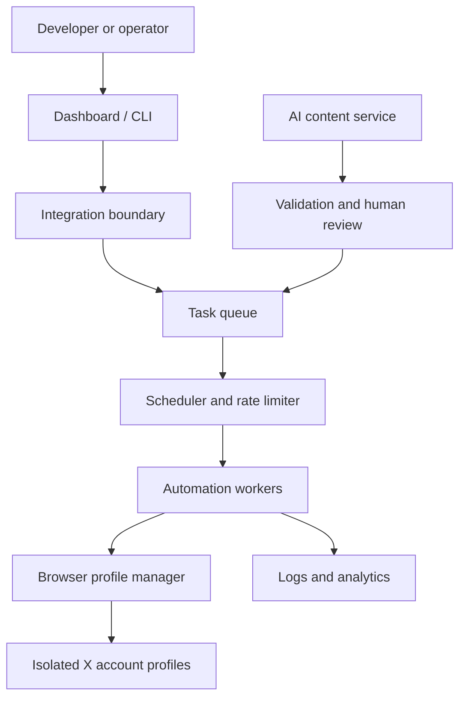

# X Growth Tool

An open-source technical reference for building an X growth tool around account operations, browser automation, AI-assisted content, scheduling, analytics, and responsible X/Twitter growth workflows.

An X growth tool is most useful when it makes repeatable work observable and reviewable. This repository documents the architecture behind multi-account X automation, while keeping provider-specific integrations and production credentials outside the examples. It is intended for developers, marketers, and automation builders studying an X automation tool or designing a Twitter growth tool with clear operational controls.

> **Scope:** documentation, reference architecture, and small configuration examples. This repository does not claim to be a complete hosted service or to provide undocumented platform endpoints.

## Features

| Area | Documented capabilities | Status |
| --- | --- | --- |
| AI content | Tweet generation, rewriting, comment drafts, validation and review queues | Reference workflow |
| Growth automation | Follow/follow-back, likes, replies, reposts, keyword targeting and engagement tasks | Website-confirmed capability; implementation details are reference architecture |
| Account management | Import/export, groups, status tracking, bulk operations and account profiles | Website-confirmed capability |
| Browser automation | Persistent profiles, isolated sessions, cookie/local-storage boundaries and proxy assignment | Website-confirmed capability; internals are reference architecture |
| Scheduling | Scheduled posting, queues, retries, rate limits and audit logs | Website-confirmed scheduling; queue design is reference architecture |
| Messaging | Direct messages and group workflows with review controls | Website-confirmed capability |
| Data | Profile, follower/following, tweet and engagement collection with filters | Website-confirmed capability |

## Architecture



The queue, workers, and integration boundary above are a **Reference Architecture**. The source website confirms the product capabilities and workflows, but does not publish a complete open-source implementation of these components.

## Quick Start

This repository is documentation-first. Start by copying the examples and adapting them to a compliant integration:

```bash
git clone https://github.com/<your-account>/x-growth-toolkit.git
cd x-growth-toolkit
python examples/validate_config.py examples/account-profile.example.json
```

No API key, password, cookie, token, or private account data is required for the examples.

## Documentation

- [Architecture](docs/architecture.md)
- [Browser profile isolation](docs/browser-profile-isolation.md)
- [Multi-account design](docs/multi-account.md)
- [Account safety](docs/account-safety.md)
- [Protocol and API architecture](docs/api.md)
- [AI automation](docs/ai-automation.md)
- [Scheduling](docs/scheduling.md)
- [Scraping and data handling](docs/scraping.md)
- [Research notes](docs/research.md)

## Screenshots

The source website exposes public interface imagery for its dashboard, account management, and automation modules. The `docs/images/` path is reserved for authorized, brand-neutral captures; no image is included without a verified redistribution path. Any future capture must be labeled as source-product context, not as a screenshot of this reference implementation.

## Responsible Use

Automation should respect platform rules, user consent, privacy obligations, and applicable law. Use dry runs, rate limits, human review, account health checks, and clear opt-out paths. This project does not promise immunity from restrictions or enforcement.

The primary keyword for this repository is **X growth tool**. Related terms such as Twitter growth tool, X automation tool, X growth automation, X browser automation, X multi-account management, and X scheduling appear where they describe a documented workflow.

## FAQ

### What is an X growth tool?

An X growth tool is software that organizes content, engagement, account operations, and measurement for X/Twitter. A useful tool exposes task state and review controls instead of hiding activity behind opaque automation.

### What is X growth automation?

X growth automation is the use of repeatable workflows for publishing, audience research, engagement, and reporting. Good implementations apply rate limits, retries, audit logs, and human review where context matters.

### How does browser profile isolation work?

Each account is assigned an independent persistent browser profile. Cookies, local storage, session state, and optional proxy settings remain scoped to that profile. See the [isolation guide](docs/browser-profile-isolation.md).

### Can one browser manage multiple X accounts?

It can, but a single shared profile makes session boundaries and troubleshooting harder. Separate persistent contexts provide clearer ownership and reduce cross-contamination between account state.

### Why use separate browser profiles for X accounts?

Separate profiles preserve independent cookies, storage, sessions, and proxy configuration. They help reduce operational risk and make account health investigations reproducible.

### What is the difference between X automation and X growth automation?

X automation is broad task execution. X growth automation focuses on growth workflows such as content distribution, audience targeting, engagement, scheduling, and measurement.

### Can X growth tools use AI?

Yes. An AI-assisted workflow can draft tweets or comments, validate length and policy constraints, route drafts for review, schedule approved content, and measure outcomes.

### Can X growth workflows be scheduled?

Yes. A scheduler can place approved jobs in a queue with timezone-aware execution, rate limits, retries, and an audit trail.

### How does multi-account X management work?

An account manager maps each account to a profile, proxy policy, session state, and task permissions. Workers then execute jobs against the mapped profile and emit structured logs.

## Research Basis

The feature inventory is based on the public product pages reviewed during repository preparation. Similar open-source repositories were studied for information architecture, badges, screenshots, tables of contents, contribution guidance, and commit-sized documentation updates; no source text or code was copied.

## Contributing

See [CONTRIBUTING.md](CONTRIBUTING.md) for documentation and example-quality guidelines.

## License

MIT. See [LICENSE](LICENSE).
