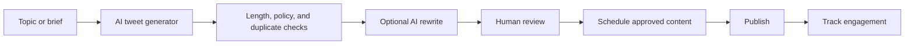
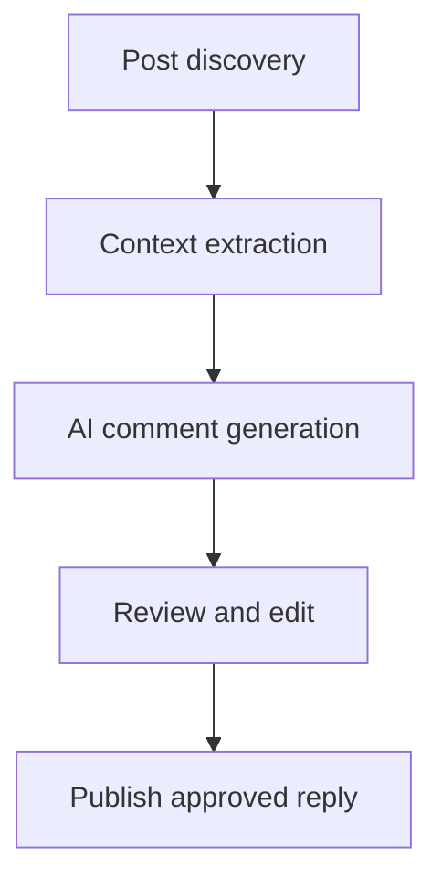

# AI Automation

AI is most useful as a controlled content assistant. A production workflow should preserve a human decision point before publishing or sending a message.

## Content workflow

## Comment workflow

Validation should check length, links, prohibited content, duplicate phrasing, and account voice. Keep prompts, generated drafts, approvals, and final outcomes in separate audit records so a reviewer can reconstruct what happened.
