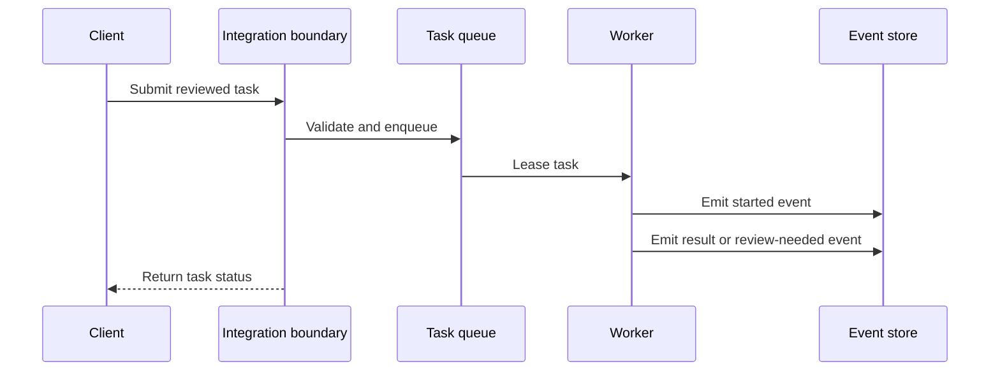

# Protocol and API Architecture

The public product material reviewed for this repository describes API-based login and management at a high level, but does not publish a complete public endpoint specification. This document is therefore a **Reference Architecture**, not an API contract for a live service.

## Suggested resource model

| Resource | Purpose |
| --- | --- |
| Account | Identity, profile mapping, permissions, health state |
| Task | A single observable action with an idempotency key |
| Schedule | Time window, timezone, recurrence, and jitter policy |
| Event | Progress, review, success, or failure record |
| Analytics | Aggregated delivery and engagement measurements |

## Integration flow

Possible integration surfaces include account management, task submission, scheduling, analytics, and webhooks. Endpoint names, authentication schemes, payloads, and quotas must be defined against the actual provider or deployment before implementation.
