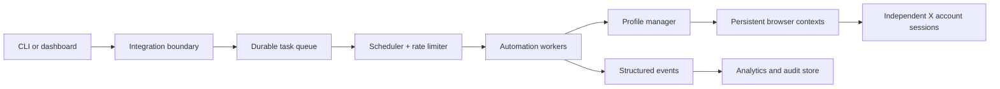

# Architecture

This document separates website-confirmed capabilities from a possible implementation. The public product material describes account management, AI content, scheduling, engagement, scraping, proxies, profile isolation, and analytics. The components below are a design reference for developers; they are not a claim about a proprietary internal stack.

## Reference topology

## Job lifecycle

1. Validate a task against account permissions and safety policy.
2. Enqueue it with an idempotency key and desired execution window.
3. The scheduler applies account-level and action-level rate limits.
4. A worker leases the task, opens the mapped profile, and records progress.
5. Retries use bounded backoff and stop after the configured attempt limit.
6. Completion, failure, and human-review events are written to the audit stream.

## Confirmed vs. possible

| Element | Evidence level |
| --- | --- |
| AI tweet generation, rewrite, comments | Public product feature description |
| Follow, like, repost, reply, DM, scraping | Public product feature description |
| Account groups, import/export, profile status | Public product feature description |
| Queue and worker implementation | Possible implementation |
| Event schema and webhook delivery | Reference architecture |

## Observability

Every worker action should emit an event containing task ID, account ID, profile ID, action type, start time, end time, outcome, and a redacted error code. Metrics should be aggregated before publication so raw account identifiers and message content do not leak into dashboards.
