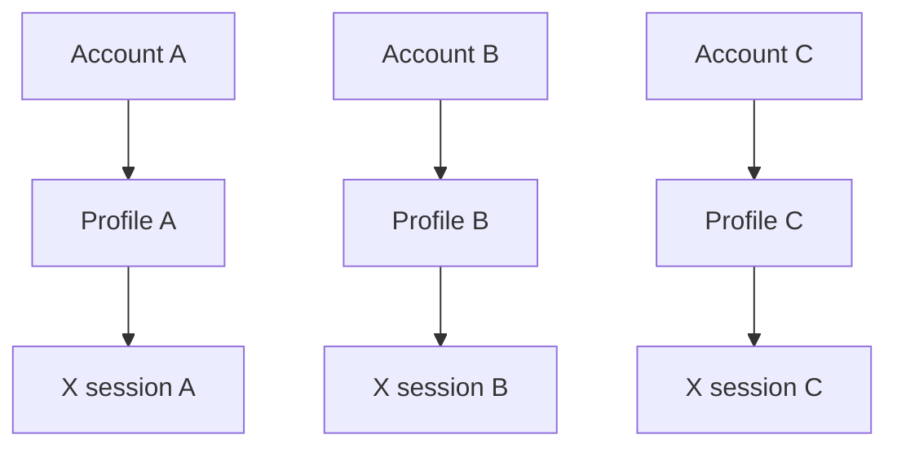

# Browser Profile Isolation

Browser profile isolation matters whenever several X accounts are operated from one workstation or service. The design goal is not to promise invisibility; it is to reduce account cross-contamination, improve session isolation, and make operational state easier to inspect.

## One account, one profile

Each profile should own:

- Independent cookies
- Independent local storage
- Independent browser state
- Independent session data
- Optional proxy configuration

Persistent contexts allow a worker to resume an account's intended state without copying data into another account. A profile registry should store only a reference to the encrypted location of state, never raw credentials in a repository.

## Why not one shared browser profile?

One browser with multiple accounts can mix cookies, local storage, cached permissions, and proxy assumptions. Separate profiles improve troubleshooting and help maintain independent account environments. They do not remove platform policy obligations or guarantee that an account will avoid restrictions.

## Operational checklist

- Assign a stable profile identifier to each account.
- Keep profile paths outside source control.
- Test launch and shutdown behavior before enabling write actions.
- Record profile, proxy policy, and task ID in audit logs.
- Revoke and rotate access when an account is retired.

## Failure recovery

If a profile cannot be opened, pause its queued jobs and preserve the last known event. Recovery should be explicit and reviewable; do not silently fall back to another account profile.
