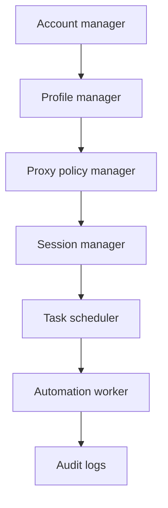
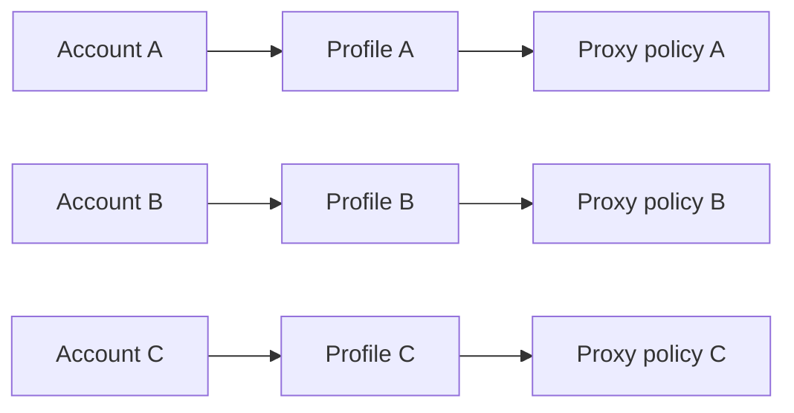

# Multi-account Architecture

Multi-account X management is easiest to reason about as a chain of explicit ownership boundaries.

Example mapping:

The account manager owns metadata and permissions. The profile manager opens persistent contexts. The proxy manager applies a documented policy, while the session manager handles startup, health checks, and shutdown. Workers should never choose an account implicitly; every job must include an account ID and a review policy.

## Bulk operations

Bulk actions should be represented as many independently observable jobs, not one opaque loop. This enables partial retry, per-account pause, and an audit trail for every attempted action.
