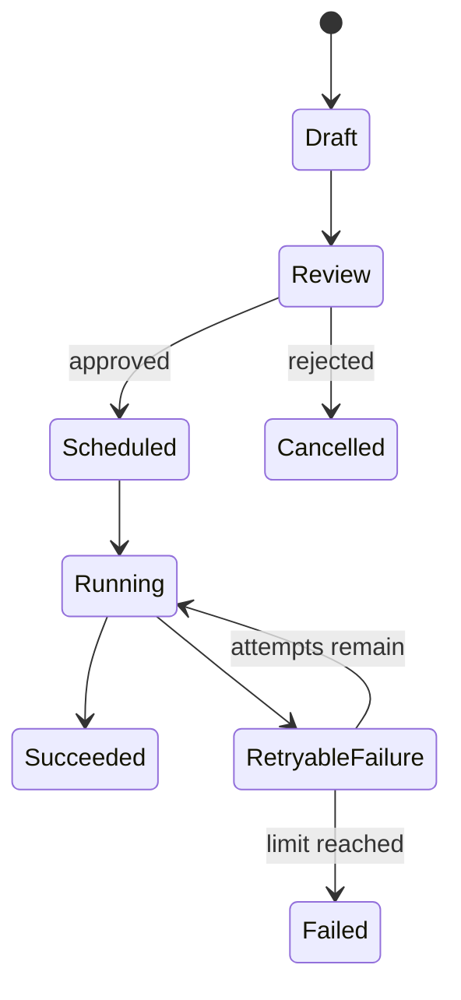

# Scheduling

Scheduling turns approved content and engagement tasks into observable, rate-limited jobs.

## Scheduler responsibilities

- Normalize timestamps to an explicit timezone.
- Enforce account and action rate limits.
- Add bounded jitter when it improves load distribution.
- Lease jobs so only one worker executes a task at a time.
- Retry transient failures with exponential backoff.
- Pause after repeated failures or account-health warnings.
- Emit structured events for planned, started, completed, and failed states.

## Example state machine

