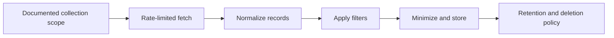

# Scraping and Data Handling

The reviewed product material lists profile, follower/following, tweet, media, keyword, and engagement data collection with filters. Any implementation must verify platform terms, applicable law, and the rights of people whose data is processed.

## Pipeline

Use the minimum fields required for the stated purpose. Avoid storing passwords, raw session cookies, or unrelated personal data. Record collection time, source, and filter criteria so results can be audited and removed when retention expires.
